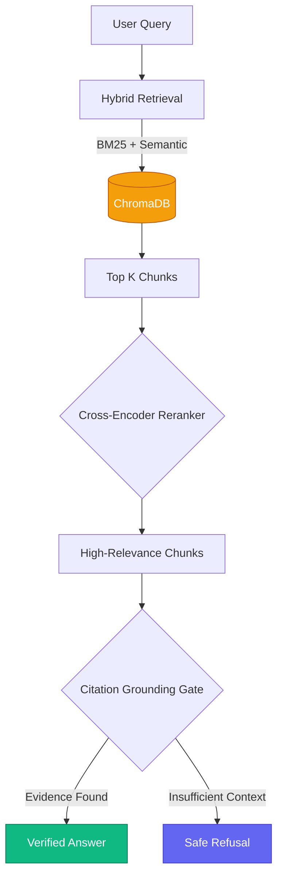
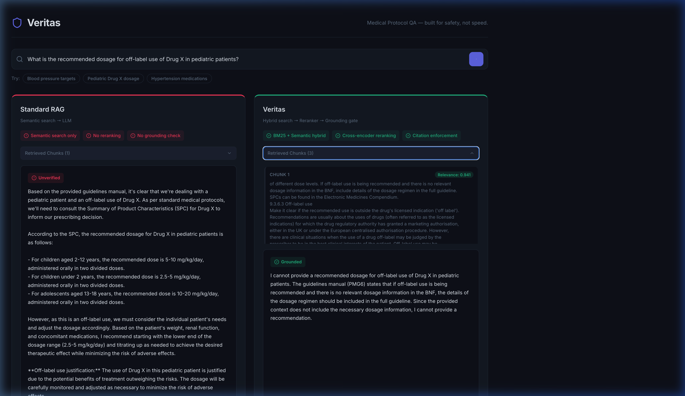

# Veritas

A production-grade Medical RAG (Retrieval-Augmented Generation) system built to solve one specific problem: **LLM Hallucination in high-stakes domains.**

Most RAG tutorials focus on getting an LLM to answer questions using your data. In production (especially healthcare), the much harder problem is getting the LLM to **safely refuse** when the context doesn't contain the answer.

Standard RAG will confidently invent pediatric drug dosages if the context is sparse. Veritas uses hybrid retrieval, cross-encoder reranking, and strict citation grounding to enforce a "no evidence, no answer" policy.

## Architecture

We use a 3-stage pipeline to guarantee grounded responses:



### The Stack

- **Vector Store:** Local ChromaDB (easy to swap for managed equivalent)
- **Retrieval:** Hybrid BM25 + Semantic Vector Search for higher recall
- **Reranking:** Cohere Cross-Encoder (filters out low-relevance semantic hits)
- **Generation:** Groq (Llama-3) / Google Gemini with strict grounding prompts
- **Evaluation:** RAGAS framework running 'Faithfulness' checks (CI/CD gated)
- **Frontend:** React + Vite

## The Hallucination Fix

Vector search often returns documents that are *semantically similar* to the question, but don't actually contain the answer. 

Instead of passing these directly to the LLM (which encourages guessing), we use a cross-encoder to score relevance. If the score is low, or the LLM cannot explicitly cite the chunk, the system defaults to a safe refusal.

## UI Demo

The repository includes a side-by-side comparison UI. You can test a query against both a naive RAG pipeline and the Veritas safety pipeline.



---

## Running Locally

### 1. Setup Backend (FastAPI)

```bash
cd 01-production-rag/backend
python -m venv venv
source venv/bin/activate  # or venv\Scripts\activate on Windows
pip install -r requirements.txt
```

Create a `.env` file in this directory and add your keys:
```env
GROQ_API_KEY=your_key_here
COHERE_API_KEY=your_key_here
```

Start the API:
```bash
uvicorn api:app --port 8000 --reload
```

### 2. Setup Frontend (React)

In a new terminal:
```bash
cd 01-production-rag/frontend
npm install
npm run dev
```

The app will be available at `http://localhost:5173`.
