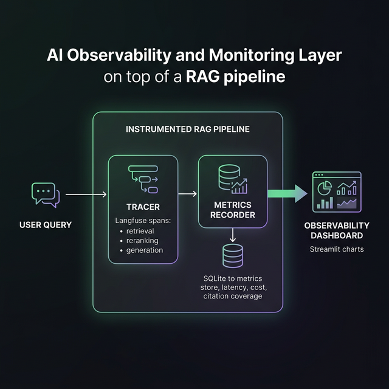
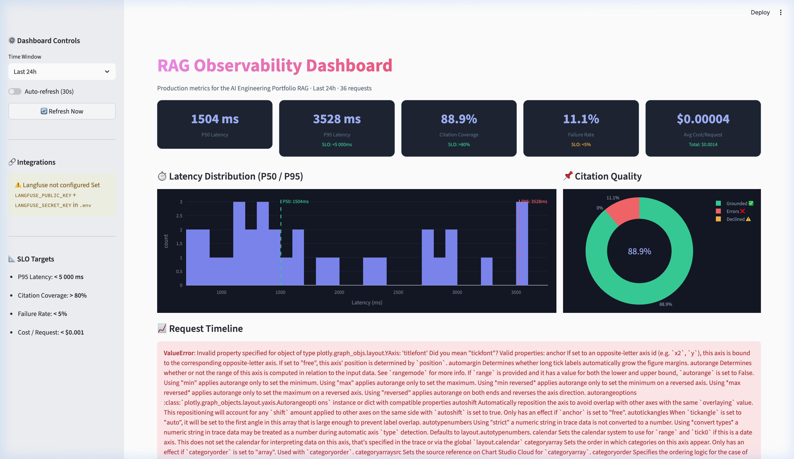

# Project 3: AI Monitoring & Observability

> **Extends** [Project 1 — Production-Grade RAG](../01-production-rag/README.md)

This project adds a full observability layer on top of the RAG system built in Project 1 — focusing on the 70% of AI engineering that happens *after* the initial build: diagnostics, reliability, and cost accountability.

## Architecture



```
User Query
    │
    ▼
InstrumentedRAGPipeline  ← wraps Project 1 modules
    ├── RAGTracer         ← Langfuse spans per step
    │   ├── span: hybrid-retrieval   (chunks + scores)
    │   ├── span: cohere-reranker    (order delta)
    │   └── generation: llm-call     (prompt + tokens)
    │
    └── MetricsRecorder   ← SQLite persistence
        ├── latency_ms    (P50 / P75 / P95 / P99)
        ├── cost_usd      (per-request USD estimate)
        ├── is_grounded   (citation coverage %)
        └── is_error      (failure rate %)
```

## What's Monitored

| Metric | Description | SLO Target |
|--------|-------------|-----------|
| **P50 Latency** | Median response time | — |
| **P95 Latency** | Tail latency (99th percentile) | < 5 000ms |
| **Citation Coverage** | % of responses with cited sources | > 80% |
| **Failure Rate** | % of requests that errored | < 5% |
| **Cost / Request** | USD estimate from token counts | < $0.001 |

## Directory Structure

```
03-monitoring/
├── dashboard.py              ← Streamlit observability dashboard
├── seed_metrics.py           ← Generate synthetic data for demo
├── src/
│   ├── tracer.py             ← Langfuse tracing wrapper
│   ├── metrics.py            ← SQLite-backed SRE metrics
│   ├── instrumented_pipeline.py  ← Traced RAG pipeline
│   └── regression.py         ← CI regression gate
├── data/
│   └── metrics.db            ← Auto-created SQLite DB
└── requirements.txt
```

## Getting Started

### 1. Install Dependencies
```bash
cd 03-monitoring
pip install -r requirements.txt
```

### 2. Configure (Optional — Langfuse for cloud tracing)
Add to your `.env` in the root directory:
```env
LANGFUSE_PUBLIC_KEY=your_key
LANGFUSE_SECRET_KEY=your_secret
LANGFUSE_HOST=https://cloud.langfuse.com  # or self-hosted
```
The system works without Langfuse — it falls back to local-only SQLite metrics.

### 3. Seed Demo Data
```bash
python seed_metrics.py
```

### 4. Launch the Dashboard
```bash
streamlit run dashboard.py
```
Open **http://localhost:8501** (or 8502 if 8501 is occupied).



### 5. Run a Monitored Query
```python
from src.instrumented_pipeline import InstrumentedRAGPipeline

pipeline = InstrumentedRAGPipeline(llm_provider="groq").build(["../01-production-rag/project 1.pdf"])
result = pipeline.query("What is the tech stack?")
print(result["answer"])
print(f"Latency: {result['latency_ms']}ms | Cost: ${result['cost_usd']:.6f}")
```

## CI/CD Regression Gate

Every Pull Request that touches `01-production-rag/` or `03-monitoring/` triggers an automatic regression evaluation via GitHub Actions (`.github/workflows/monitoring_regression.yml`).

The build **fails** if:
- P95 latency > 8 000ms
- Citation coverage < 70%

## Technical Challenges

- **Tracing granularity** — Instrument individual LangChain retrieval and reranking steps without patching internal library code by using callback handlers.
- **Cost without billing access** — Approximated per-request cost using published token pricing tables and local whitespace-based token counting as a lightweight tiktoken alternative.
- **Realistic percentile tracking** — Used numpy percentile on in-memory arrays read from SQLite rather than maintaining approximate data structures, keeping the implementation simple and exact.
